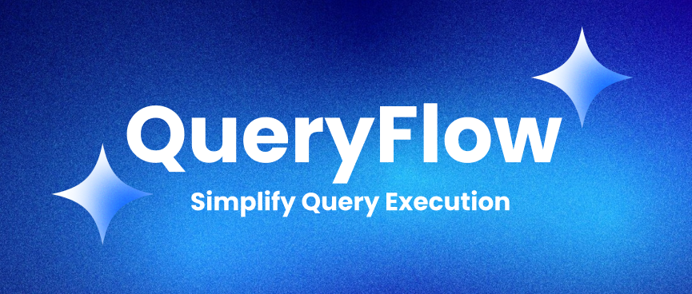

# [QueryFlow](https://query-flow-xi.vercel.app)



## Project Overview

QueryFlow is an application which allows users to write, execute, and manage SQL queries with a focus on usability, performance, and advanced functionality. Core features include a SQL query editor, dropdown predefined query selector, table to display data, while additional features include query history, and CSV export, virtualization for large datasets, rate limiting, and dark mode enhance the user experience. The project demonstrates the functionalities, performance optimization, and user-focused design.

## System Architecture


## Deployed Link

- Live Link: [QueryFlow Website](https://query-flow-xi.vercel.app/)

## Core Features

- **SQL Query Editor**: Write SQL queries using `AceEditor` with MySQL syntax highlighting, auto-completion and theme support.
- **Dropdown Predefined Query Selector**: Select and execute predefined queries from a dropdown list.
- **Table to Display Data**: View query results in a responsive table.

## Additional Features

- **Query History**: View the last 5 executed queries from a history list.
- **CSV Export**: Export query results as a CSV file for further analysis.
- **Dark Mode**: Toggle between light and dark modes for better accessibility.
- **Rate Limiting**: Limits users to 10 queries per minute with a countdown timer.

### Brownie Points: Virtualization for Large Data

- **Virtualized Table**: Handles large datasets using `react-window` for efficient rendering.

## JavaScript Framework and Dependencies

- **Framework**:
  - **React.js**: JavaScript framework used to build user interfaces.
  - **TypeScript**: Superset of JavaScript for type safety.
- **Major Plugins and Packages**:
  - `"react-window": "^1.8.11"`: For virtualized tables to handle large datasets.
  - `"react-table": "^7.8.0"`: For rendering tabular data.
  - `"react-ace": "^14.0.1"`: For the query editor with syntax highlighting.
  - `"papaparse": "^5.5.2"`: For CSV export functionality.
  - `"sonner": "^2.0.2"`: For toast notifications.
  - `"@mui/icons-material": "^6.4.8"`: For adding icons.
  - `"@mui/material": "^6.4.8"`: For responsive, theme-aware UI components.

## Page Load Time


- **Measurement**: The page load time was measured using Chrome DevTools' **Lighthouse** tool
- **Result**: The page load time is approximately **0.4 seconds** to **1.0 seconds**.
- **How It Was Measured**:
  - Opened Chrome DevTools, navigated to the Lighthouse tab, and ran a performance audit with the following settings:
  - Recorded the TTI metric from the Lighthouse report.

## Performance Optimizations

Several optimizations were applied to decrease load time and increase overall performance:

- **Lazy Loading**: Lazy-loaded components using `React.lazy` and `Suspense`, reducing the initial bundle size.
- **Suspense Fallbacks**: Added loading states for lazy-loaded components to enhance user experience.
- **Static Styles in CSS**: Moved static styles to `App.css`, reducing First Contentful Paint (FCP).
- **Component Splitting**: Split `AppHeader` and `MobileDrawer` to minimize re-renders, improving responsiveness.

## Pros and Cons of Proposed Solution

### Pros

- Includes core features like query editor, selector, and table, plus advanced ones like history and CSV export.
- Virtualized table handles 1,000 rows efficiently using react-window
- AceEditor, dark mode, and responsive design enhance usability.
- TypeScript, modular structure, and JSDoc comments improve maintainability.
- Rate limiting to limit users to 10 queries per minute with a countdown timer.

### Cons

- Only supports basic SELECT \* FROM table queries.
- Uses mock data instead of a real backend API.

## Solution Future Aspects

- Add more robust query validation (e.g., using a SQL parser).
- Replace mock data with a real backend API to execute queries against a database.
- Allow users to select from multiple themes beyond light and dark modes.

## Setup Instructions for Local development

1. **Clone the Repository**:

   ```bash
   git clone https://github.com/Shreekar11/QueryFlow.git
   cd QueryFlow
   ```

2. **Install Dependencies**

   ```bash
   npm install --legacy-peer-deps
   ```

3. **Run the Development**

   ```bash
   npm run dev
   ```

## Contact

For any inquiries or support, please email us at shreekargade2004@gmail.com or open an issue in this repository.
