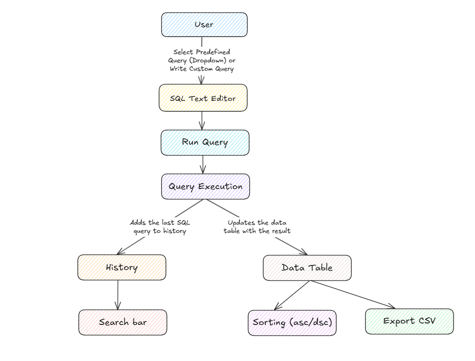

<!-- # [QueryFlow](https://query-flow-xi.vercel.app) -->


> Execute your Queries with ease

## Project Overview

QueryFlow is an application that allows users to write, execute, and manage SQL queries with a focus on usability, performance, and advanced functionality. Core features include a SQL query editor for executing queries, a dropdown for selecting predefined queries, and a table for displaying data. Additional features include virtualization for rendering large datasets to optimize performance, query history, searchable query history, CSV export, data sorting, and dark mode to enhance the user experience. The project showcases various functionalities, performance optimizations, and a user-focused layout design.

## Demo Video

**Video** - [Watch QueryFlow Demo🚀](https://www.loom.com/share/eeff27b80f294b47b6068b6178b4de08?sid=64550084-4579-4b8b-9140-37b4a1eabf85)

## Deployment Information

**Live Link** - [QueryFlow Website🚀](https://query-flow-xi.vercel.app/)<br>
**Vercel** - Deployment platform for frontend

## Features

### Core Features

- **SQL Query Editor**: Write and run SQL queries easily using `AceEditor`, with MySQL syntax highlighting for better readability.
- **Dropdown Predefined Query Selector**: Select and execute predefined queries from a dropdown list.
- **Table to Display Data**: View query results in a responsive table.

### Additional Features

- **Optimized Table Rendering for Large Datasets**: Efficiently render large datasets using `react-window` without impacting browser performance.
- **Query History**: Access the executed queries from the history list.
- **Search Query History**: Quickly find previously executed queries using a search function within the history list.
- **CSV Export**: Export query results as a CSV file.
- **Sorting Functionality**: Sort table data in ascending or descending order by clicking on the table headers.
- **Dark Mode**: Switch between light and dark themes for enhanced accessibility.

## Flow Diagram



## Tech Stack

### Framework and Language

- **React.js** – JavaScript framework for building user interfaces.
- **TypeScript** – Superset of JavaScript for type safety.

### Major Plugins and Packages

- **UI & Styling**
  - `"@mui/material": "^6.4.8"` – Responsive, theme-aware UI components.
  - `"@mui/icons-material": "^6.4.8"` – Material UI icons.
- **Tables & Large Data Handling**
  - `"react-window": "^1.8.11"` – Optimized rendering for large datasets.
  - `"react-table": "^7.8.0"` – Lightweight, flexible table library.
- **Query Editor & Syntax Highlighting**
  - `"react-ace": "^14.0.1"` – SQL query editor with syntax highlighting.
- **Data Export**
  - `"papaparse": "^5.5.2"` – CSV export functionality.
- **Notifications**
  - `"sonner": "^2.0.2"` – For toast notifications.

## Page Load Time


- **Measurement**: The page load time was measured using Chrome DevTools' **Lighthouse** tool
- **Result**: The page load time is approximately **0.4 seconds** to **1.0 seconds**.
- **How It Was Measured**:
  - Opened Chrome DevTools, navigated to the Lighthouse tab, and ran a performance audit.
  - Recorded the TTI metric from the Lighthouse report.

## Performance Optimizations

Several optimizations were applied to decrease load time and increase overall performance:

- **Lazy Loading**: Lazy-loaded components using `React.lazy` and `Suspense`, reducing the initial bundle size.
- **Suspense Fallbacks**: Added loading states for lazy-loaded components to enhance user experience.
- **`useCallback` & `useMemo` Hooks**:
- **`useCallback`**: Used to memoize functions, preventing unnecessary re-creations on re-renders and improving performance in event handlers and callbacks passed as props to child components. For example:

  ```jsx
  const handleQuerySelect = useCallback(
    (queryId: number, type: string) => {
      const query = mockQueries.find((q) => q.id === queryId);
      if (query) {
        const { id, query: queryText, data } = query;

        setSelectedQuery((prev) => ({
          ...prev,
          id,
          query: queryText,
          data: type === "LIST" ? prev.data : data,
        }));

        setCustomQuery(queryText);
        setDrawerOpen(false);
        setQueryError(null);
      }
    },
    [setCustomQuery, setDrawerOpen, setQueryError, setSelectedQuery]
  );
  ```

- **`useMemo`**: Memoizes expensive calculations, ensuring they are only recomputed when dependencies change, reducing redundant computations. For example:

  ```jsx
  const shouldUseVirtualization = useMemo(() => {
    return useVirtualization || data.data.length > 500;
  }, [useVirtualization, data.data.length]);

  const columns = useMemo(() => {
    if (data.data.length === 0) return [];
    return Object.keys(data.data[0]).map((key) => ({
      Header: key.charAt(0).toUpperCase() + key.slice(1),
      accessor: key,
    }));
  }, [data]);
  ```

- **Component Splitting**: Split code into smaller components to minimize re-renders and improve responsiveness.
- **Static Styles in CSS**: Moved static styles to `App.css`, reducing First Contentful Paint (FCP).

## Pros and Cons of Proposed Solution

### Pros

- Includes core features like a query editor, selector, and table, along with advanced features such as history, searchable query history and CSV export.
- The data table efficiently handles around 1,000 rows using virtualization for optimal performance.
- Supports sorting functionality, allowing users to sort table data in ascending or descending order by clicking on column headers.
- AceEditor, dark mode, and a responsive design enhance usability.
- TypeScript, a modular structure, and JSDoc comments improve maintainability.

### Cons

- Currently supports basic SELECT \* FROM table queries.
- Uses mock data instead of a retrieving from backend server.

## Solution Future Aspects

- Add more robust query validation (e.g., using a SQL parser).
- Replace mock data with actual backend server to execute queries against a database.

## Setup Instructions for Local development

1. **Clone the Repository**:

   ```bash
   git clone https://github.com/Shreekar11/QueryFlow.git
   cd QueryFlow
   ```

2. **Install Dependencies**

   ```bash
   npm install --legacy-peer-deps
   ```

3. **Run the Development**

   ```bash
   npm run dev
   ```

4. Open http://localhost:5173 in your browser to see the application.

## Contact

For any inquiries or support, please email us at shreekargade2004@gmail.com or open an issue in this repository.
